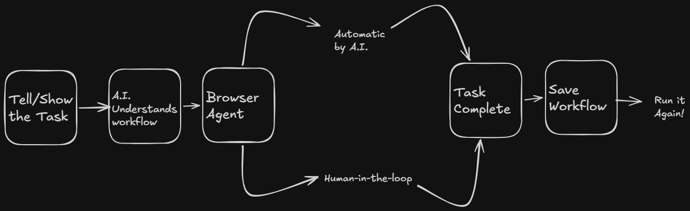
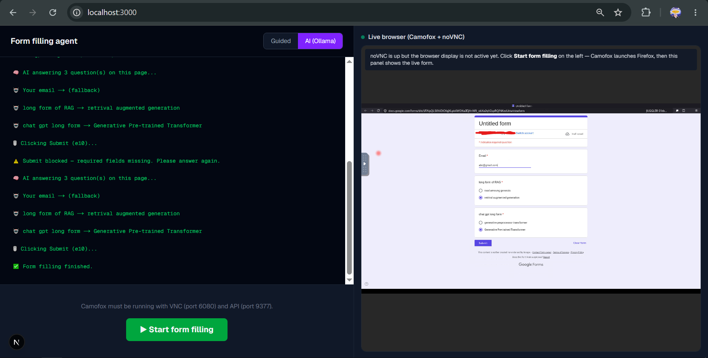

  
  <h1>The AI that does your repetitive web work.</h1>
  
<strong>Automate repetitive web work.</strong>

  
  

    For Everyone who uses a Web Browser :)
  

 

<h2>FOLLOW THIS TO RUN THIS PROJECT </h2>

<ol type="number">
  <li> To run the frontend use command! <code> npm run dev</code> </li>
  <li> To start the form filler agent run this command  <code>node dashboard-server.js</code> </li>
  <li> To start ollama server (use  qwen2.5:3b) use this  <code>ollama serve</code> </li>
  <li> To run the docker use docker command to run by 
<pre>
docker run --rm   
-p 9377:9377   
-p 127.0.0.1:6080:6080   
-e ENABLE_VNC=1   
-e VNC_BIND=0.0.0.0   
-e VNC_PASSWORD=your-secret-password   
camofox-browser
</pre>

  </li>

</ol>

